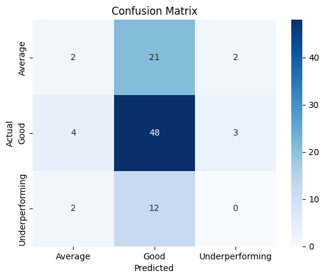
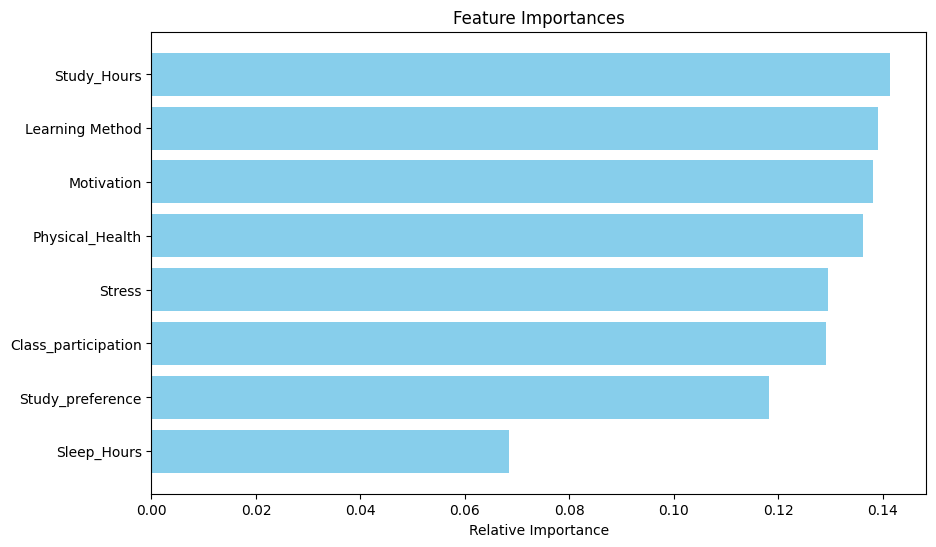

# Collection and preprocessing of data 

## collecting the data
The collection of data from classmates, collegemates and friends outside college through a google form.

## Data cleaning
Since the form was open for everyone, it has junk data which could potentially ruin the model's performance. We used imputation methods like KNN imputation to fill in most important data. 

## Encoding
Some of the entries were unique, like Computer science, Data science.. which were converted to engineering. This process has been done in multiple columns 

# Objectives 

## 1. Performance score prediction
We create a model using features such as 
* Sleep_Hours ,  
* Physical_Health, 
* Study_Resources, 
* Marks, 
* Attendance, 
* Late_submissions, 
* Consistency', 
* Teacher_Support' and 
* Peer_Influence. 

All the catagorical data are encoded into certain values, for example '80-70' is encoded to certain number say 3 and values such as positive, neutral and negative are encoded or maped to 3,2 and 1 respectively.  
We also scaled the data (normalised) so as the value lies between 0 and 1. We used **'MinMaxScaler'** $$ Xscaled = (X-Xmin)/(Xmax-Xmin) $$ as well as **'Decimal scaling'** 
  
And then we trained the model using linear regression after dividing text and training data and exported/saved the model. Then we create a separate function to take input from user and predict his/her score.
  
We calculated $$RMSE = 0.0224$$ and $$R^2 = 0.98$$ 
We also provide insight on the reason for his/her performance score being low

## 2. Habit suggestion

Right now we are working on our second main part of the project which is, grouping the user into low, average and high performing student. We used a Randomforest classifier to do this. We used 
* Study_Hours
* Sleep_Hours
* Stress
* Motivation
* Participation
* Learning_Method
* Study_Mode
* Physical_Health

features to train the classifier

 This categorisation helps to find out common traits of higher performing student and suggest those habits to avg or low performing students. 
### challenge 
The feature we chose to determine good, avg or bad is only dependent on the marks they scored before. This creates a bias towards 'good performance'. So we are still figure out what to do in order to remove this bias.

## Yet to start!
### 3. Burnout prediction 
### 4. LLM integration
### 5. General insights (clustering)
- (eg) you belong to 79% of the students who are high stressed and doing engineering

